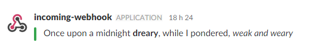
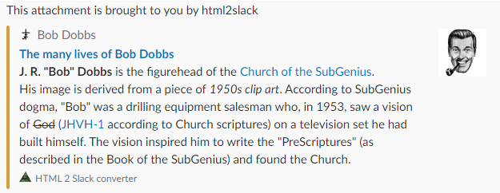
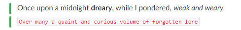
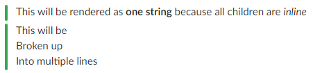

# HTML2Slack

HTML2Slack is a Node.js library to convert a subset of HTML to JSON formatted Slack attachments. It uses [html-minifier](https://www.npmjs.com/package/html-minifier) and [fast-html-parser](https://www.npmjs.com/package/fast-html-parser) to generate a simple DOM tree from an HTML document, and renders this tree as a collection of Slack attachments.

This allows you to use all existing HTML tooling (templating, previewing, etc...) in your slack bot development worklow, in an effort to make slack bots code more like regular old web applications.

## Basic usage

```javascript
const html2slack = require("html2slack")

// The HTML must have one BODY, containing one or more SECTIONs
const html = `
<body>
  <section>
    <p>Once upon a midnight <b>dreary</b>, while I pondered, <i>weak and weary</i></p>
  </section>
</body>
`

// Convert to a Slack attachment
const slack = html2slack(html)

// Post on a Slack channel, DM to a user, etc...
post(slack)
```

The HTML provided will result in the following JSON :

```json
[{
  "color": "good",
  "text": "Once upon a midnight *dreary*, while I pondered, _weak and weary_",
  "mrkdwn_in": [
    "text",
    "pretext",
    "fields"
  ]
}]
```

Which will render on Slack as the following :



## Supported tags

HTML2Slack supports all Slack formatting (`mrkdwn`), as specified [here](https://get.slack.help/hc/en-us/articles/202288908-Format-your-messages).

In most cases the corresponding HTML tags are pretty easy to guess. Here is a list of how they translate into Slack formatting :

### `<b>`, `<strong>`

Bold : `*bold*`

### `<i>`, `<em>`

Italic : `_italic_`

### `<strike>`

Strike-through : `~strike-through~`

### `<q>`

Inline quote : `> This is a quote`

### `<code>`

Inline code : 

```
Some `inline` code
```

### `<pre>`

Multi-line code : 

```
```const table = lines
    .map(formatLine)
    .join(emptyLine)```
```

### `<textarea>`

Multi-line quote : 

```
>>> Some multi line content
That will be treated as one quote
As long as it is sent in one go
```

(We use textarea because it is the only tag apart from `pre` that does not get its whitespace collapsed by minifiers. This allows us to respect indentation and white space in quoted content).

### `<a>`

Link : `<https://nodejs.org/|Node JS>`

The destination is taken from the `href` attribute and copied as is. It can be a link to a Slack channel (<#C024BE7LR|general>), a Slack user (<@U024BE7LH|Joe>) or a website.

### `<ul>`

Unordered list : 

```
* Item 1
* Item 2
* Item 3
```

The items are the `<li>` children of the rendered `<ul>`.

### `<ol>`

Ordered list.

As in HTML, you can specify a type attribute (`<ol type='1'>`), which will result in different prefixes :

#### 1

(default)

Each item will be prefixed with a number

```
1. Item 1
2. Item 2
3. Item 3
```

#### A

Each item will be prefixed with an uppercase letter :

```
A. An ordered list
B. With LETTERS
C. in front of items
```
#### a

Each item will be prefixed with a lowercase letter :

```
a. An ordered list
b. With letters
c. in front of items
```

#### I

Each item will be prefixed with an uppercase roman numeral (prefixes are padded to align the dots) :

```
  I. An ordered list
 II. With a ROMAN TOUCH
III. in front of items
```

#### i

Each item will be prefixed with a lowercase roman numeral (prefixes are padded to align the dots) :

```
  i. An ordered list
 ii. With a ROMAN TOUCH
iii. in front of items
```

### `<table>`

(experimental)

Renders the table as an ASCII art table. For the moment only `<td>` are supported, `<th>` may have unexpected side effects.

Basic formatting is available through the `align` attribute (possible values are `left`, `right` or `center`).

```
| Some content | is short             | yeah                       |
|--------------|----------------------|----------------------------|
|     But      | some is              | absurdly and stupidly long |
|--------------|----------------------|----------------------------|
|    It's also | cool to align on the |                      right |
```

## Styling attachments

All the attachment parameters from the [Slack documentation](https://api.slack.com/docs/message-attachments#attachment_parameters) can be used with HTML2Slack. You should add them as attribute to the section tag. When the parameter has an underscore in its name `_` you need to replace it with a dash `-` to conform with HTML conventions.

```html
<body>
  <section 
    color="warning"
    pretext="This attachment is brought to you by html2slack"
    author-name="Bob Dobbs"
    author-link="http://www.subgenius.com/"
    author-icon="http://www.subgenius.com/favicon.ico"
    title="The many lives of Bob Dobbs"
    title-link="http://www.subgenius.com/bigfist/answers/faqs/X0007_ARE_YOU_REALLY_A_SUB.html"
    thumb-url="https://i.imgur.com/a5m4lYE.gif"
    footer="HTML 2 Slack converter"
    footer-icon="https://a.wattpad.com/useravatar/TheJGibbs1.128.967232.jpg"
  >
    <header><b>J. R. "Bob" Dobbs</b> is the figurehead of the <a href="https://en.wikipedia.org/wiki/Church_of_the_SubGenius">Church of the SubGenius</a>.</header>
    <main>
        His image is derived from a piece of <i>1950s clip art</i>. According to SubGenius dogma, "Bob" was a drilling equipment salesman who, in 1953, saw a vision of <strike>God</strike> (<a href="https://en.wikipedia.org/wiki/Jehovah_1">JHVH-1</a> according to Church scriptures) on a television set he had built himself. The vision inspired him to write the "PreScriptures" (as described in the Book of the SubGenius) and found the Church.
    </main>
  </section>
</body>
```
Will render to this :



## Parsing rules

To be valid, the HTML must have one `<body>` tag containing one or more `<section>` tag(s).

Each section will be rendered as its own attachment, so the following HTML :

```html
<body>
  <section>
    <p>Once upon a midnight <b>dreary</b>, while I pondered, <i>weak and weary</i></p>
  </section>
  <section>
    <code>Over many a quaint and curious volume of forgotten lore</code>
  </section>
</body>
```

Will render on Slack like so (notice the gap in the green line between the attachments) :



Block-level elements such as `<p>` or `<div>` are separated by line breaks. When an element only contains inline children and/or text, it will be rendered as one string without line break :

```html
<body>
  <section>
    <p>This will be <span>rendered</span> as <b>one string</b> because all children are <i>inline</i></p>
  </section>
  <section>
    <div>This will be</div>
    <div>Broken up</div>
    <div>Into multiple lines</div>
  </section>
</body>
```
will render as :


